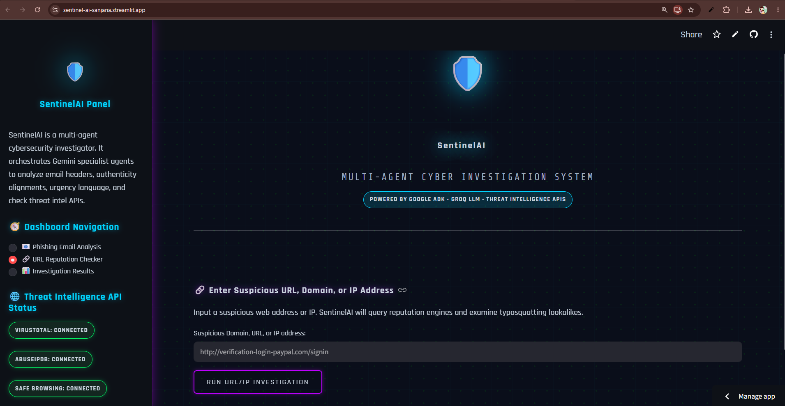
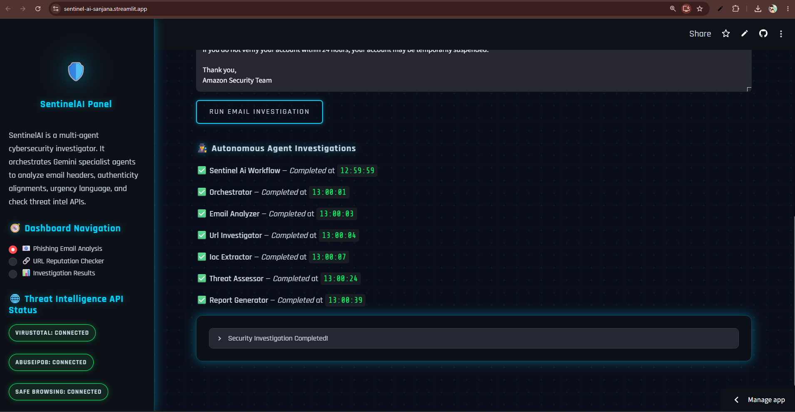
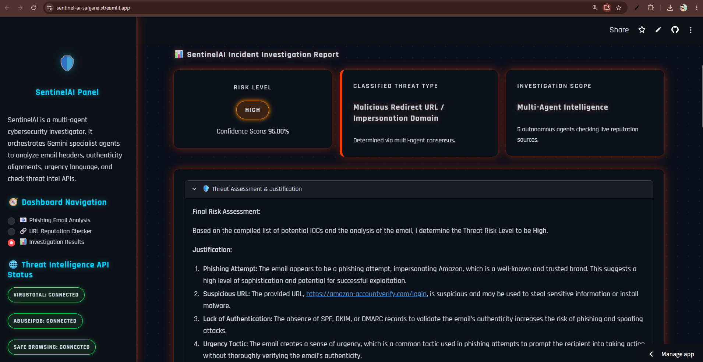
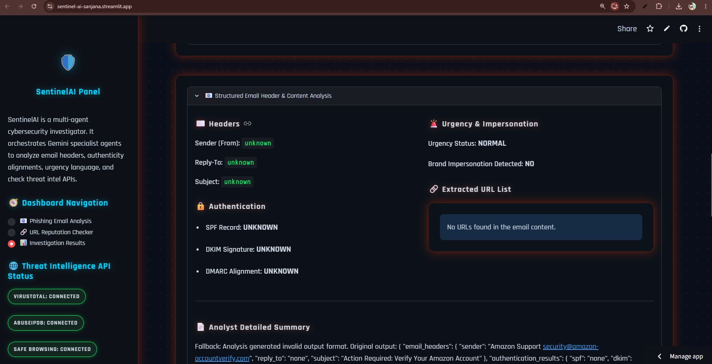
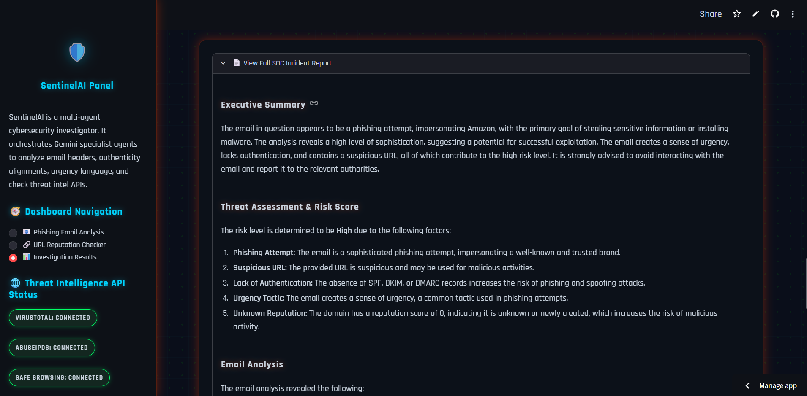

# 🛡️ SentinelAI — Multi-Agent Cyber Investigation System

<div align="center">


**An autonomous multi-agent AI system that investigates phishing emails and suspicious URLs in seconds — protecting users from cyber threats using collaborative AI agents.**

• [🚀 Live Demo](https://sentinel-ai-sanjana.streamlit.app/) • [📹 Demo Video](https://youtu.be/W9nowQh8iSw) • [📊 Architecture](#️-architecture)
• [📂 GitHub Repository](https://github.com/Sanjana-crypto/Sentinel-AI)
</div>

---

## 🎯 Problem Statement

Phishing attacks cost organizations **$17,700 every minute** globally. SOC analysts spend **2-3 hours manually** investigating each suspicious email — checking headers, analyzing URLs, cross-referencing threat databases, and writing reports.

**SentinelAI reduces this to under 30 seconds.**

---

## ✨ What SentinelAI Does

Paste a suspicious email or URL → 6 specialized AI agents collaborate → Full SOC investigation report generated automatically.

```
User Input (Email / URL)
         ↓
  [Orchestrator Agent]  ← Master coordinator
         ↓
  [Email Analyzer]      ← SPF, DKIM, DMARC, urgency detection
         ↓
  [URL Investigator]    ← Domain age, SSL, redirect chains
         ↓
  [IOC Extractor]       ← VirusTotal, AbuseIPDB, Safe Browsing
         ↓
  [Threat Assessor]     ← Risk scoring & classification
         ↓
  [Report Generator]    ← Professional SOC markdown report
```

**Output:** Risk score, threat classification, IOC table, actionable recommendations.

---

## 🏗️ Architecture

### Multi-Agent Pipeline (Google ADK 2.0)

| Agent | Role | Output |
|-------|------|--------|
| 🎯 **Orchestrator** | Routes and coordinates investigation | Investigation plan |
| 📧 **Email Analyzer** | Parses headers, checks auth, detects impersonation | Structured EmailAnalysis schema |
| 🔗 **URL Investigator** | Checks domain reputation, redirects, SSL | URL risk findings |
| 🔍 **IOC Extractor** | Queries VirusTotal, AbuseIPDB, Safe Browsing | IOC table |
| ⚠️ **Threat Assessor** | Computes final risk: Low/Medium/High/Critical | Risk level + justification |
| 📄 **Report Generator** | Compiles professional SOC report | Markdown SOC report |

## 🛠️ Tech Stack

```text
AI Framework  : Google ADK 2.0
Inference     : Groq LLM (Llama 3.3 70B / Mixtral)
Language       : Python 3.10+

Frontend       : Streamlit (Cyber SOC Dashboard)
Backend         : Python + Google ADK Multi-Agent Workflow

Threat Intel   : VirusTotal API
                 AbuseIPDB API
                 Google Safe Browsing API

Multi-Agent    : Orchestrator Agent
                 Email Analyzer
                 URL Investigator
                 IOC Extractor
                 Threat Assessor
                 Report Generator

Agents CLI     : google-agents-cli

Deployment     : Streamlit Cloud
                 Docker

Configuration  : python-dotenv
                 .env Secret Management

Security        : Input Sanitization
                  API Key Management
                  Rate Limiting
                  Audit Logging
                  Exception Handling

Testing         : Pytest

IDE             : Google Antigravity IDE (Vibe Coding)

Version Control : Git + GitHub
```

## 🚀 Quick Start

### Prerequisites
- Python 3.10+
- `uv` package manager
- API keys (see below)

### Installation

```bash
# Clone the repository
git clone https://github.com/Sanjana-crypto/Sentinel-AI.git
cd Sentinel-AI

# Install dependencies
uv sync

# Set up environment variables
cp .env.example .env
# Edit .env with your API keys
```

### Environment Variables

Create a `.env` file:

```env
GROQ_API_KEY=gsk_...                # Groq Console (free)
VIRUSTOTAL_API_KEY=...             # VirusTotal (free tier)
ABUSEIPDB_API_KEY=...              # AbuseIPDB (free tier)
SAFE_BROWSING_API_KEY=...          # Google Safe Browsing (free)
```

### Run Locally

```bash
uv run streamlit run app/streamlit_app.py
```

Open `http://localhost:8501` in your browser.

---

## 🔐 Security Features

- ✅ **Input Sanitization** — strips null bytes, prevents injection attacks
- ✅ **Token overflow protection** — inputs truncated at 50,000 characters
- ✅ **API key management** — all keys via `.env`, never hardcoded
- ✅ **Error handling callbacks** — graceful fallback on model failures
- ✅ **Rate limiting** — prevents API abuse
- ✅ **Audit logging** — all investigations logged with timestamp

---

## 📸 Screenshots

### Dashboard


### Agent Timeline


### Final Result


### Email Analysis


### SOC Report



---

## 🧪 Running Tests

```bash
# Run all unit tests
uv run pytest tests/unit

# Run with coverage
uv run pytest tests/ --cov=app

# Lint check
uvx --from google-agents-cli agents-cli lint
```

---

## 🐳 Docker Deployment

```bash
# Build image
docker build -t sentinel-ai .

# Run container
docker run -p 8501:8501 --env-file .env sentinel-ai
```

---

## 📋 Course Concepts Demonstrated

| Concept | Implementation |
|---------|---------------|
| ✅ **Multi-Agent System (ADK)** | 6 specialized agents in sequential workflow |
| ✅ **MCP Server** | VirusTotal, AbuseIPDB, Safe Browsing tools |
| ✅ **Antigravity IDE** | Built entirely using Google Antigravity vibe coding |
| ✅ **Security Features** | Input sanitization, .env keys, rate limiting |
| ✅ **Deployability** | Streamlit Cloud + Docker |
| ✅ **Agent Skills** | investigate_email, analyze_url, extract_iocs, generate_report |

---

## 🗂️ Project Structure

```
sentinel-ai/
├── app/
│   ├── agent.py              # Core ADK multi-agent workflow
│   ├── mcp_tools.py          # MCP tool integrations (VirusTotal, etc.)
│   ├── streamlit_app.py      # Streamlit SOC dashboard UI
│   └── app_utils/
│       └── telemetry.py      # Logging & monitoring
├── tests/
│   ├── unit/                 # Unit tests for each agent
│   ├── integration/          # Integration tests
│   └── eval/                 # Evaluation datasets
├── CONTEXT.md                # Coding standards & project context
├── Dockerfile                # Container deployment
├── pyproject.toml            # Dependencies (uv)
└── agents-cli-manifest.yaml  # agents-cli configuration
```

---

## 🎯 The Antigravity Moment

> A security analyst manually investigating a phishing email takes **2-3 hours** — checking email headers, querying threat databases, analyzing URLs, writing reports.
>
> **SentinelAI does this in under 30 seconds.**
>
> That's the power of multi-agent AI.

---

## 🏆 Developed as Part of

- **Kaggle AI Agents Intensive Capstone 2026**
- **Google Cloud Gen AI Academy APAC – Cohort 2**


---

## 👩‍💻 Author

**Sanjana** — [@Sanjana-crypto](https://github.com/Sanjana-crypto)

Built with ❤️ using Google ADK 2.0 + Antigravity IDE

---

<div align="center">

**SentinelAI — Protecting users from cyber threats, one investigation at a time.**


</div>


